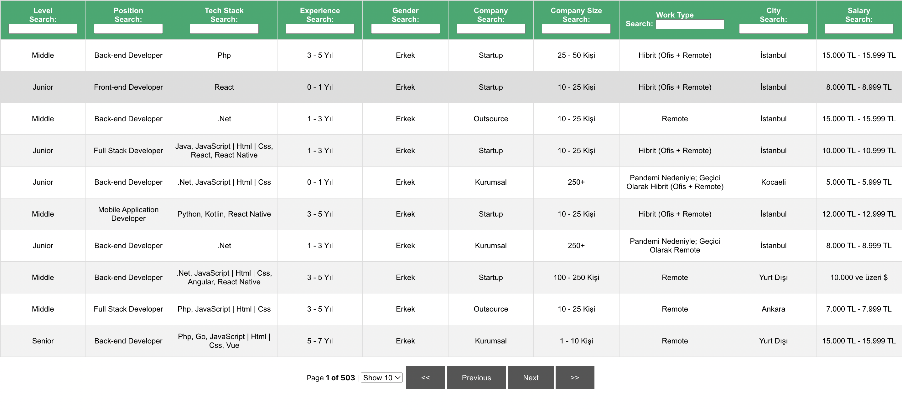

# Developer Salary Filter
A filtering app for software developer salaries in Turkey (Önceki Yazılımcı 2022)

All the of the data taken from https://github.com/oncekiyazilimci/2022-yazilimci-maaslari
You should go to https://omersah.github.io/yazilimci-maaslari-filtre/

# Search Mechanism
- Search by Level, Position, Tech Stack, Experience, Gender, Company, Company Size, Work Type, City, Salary
- Enter your search keyword to relevant text box
- Combine them with multiple input
- Select page size with dropdpown menu (10, 25, 50)

